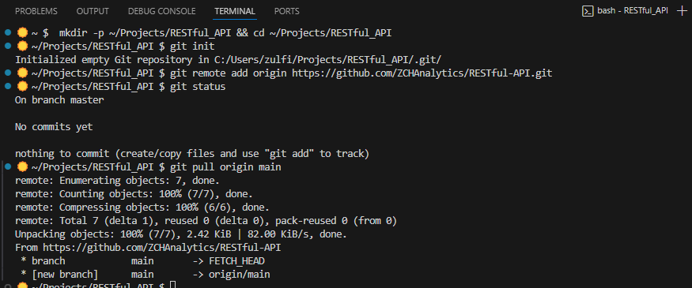
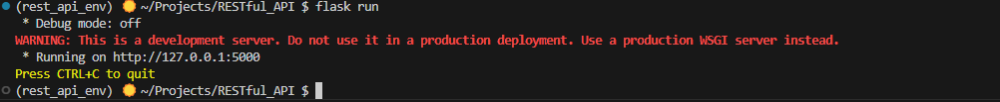
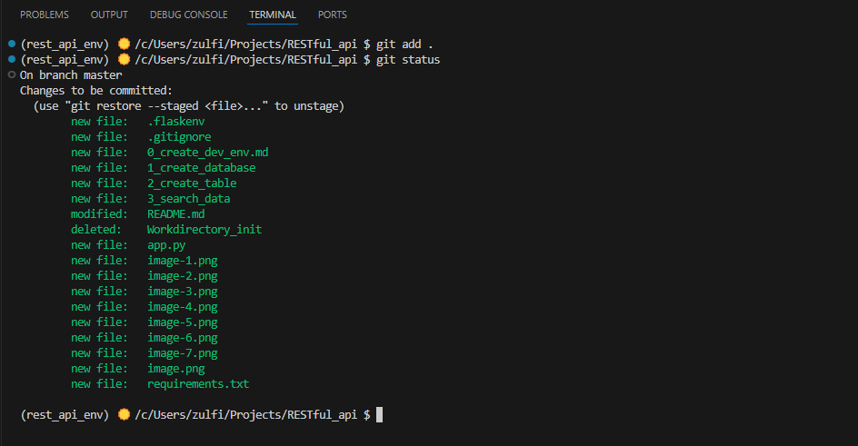

I. Set up development environemnt 

$ mkdir -p ~/Projects/RESTful_API && cd ~/Projects/RESTful_API
$ git init
$ git remote add originhttps://github.com/ZCHAnalytics/RESTful-API.git
$ git status




II. Create a virtual environment in Python
Install necessary Python packages as outlined in the tutorials

$ python -m venv rest_api_env

# COmmand to activate venv in Git Bash (also  WSL)

$ source rest_api_env/Scripts/activate 
# Installing dependencies 
$ pip install flask
Write a short test app script (app.py)
```
from flask import Flask
app = Flask(__name__)
```

$ flask run 


Start a Flask app in 'development' mode
Create .flaskenv file with 
```
# Environment variable style arguments

FLASK_APP=app
FLASK_DEBUG=1
```
## Python package to manage environment variables in .env or .flaskenv files to avoid hardcoding sensitive information like API keys or database credentials.
$ pip install python-dotenv

Create .env for environment variables not related to Flask 
Create .gitignore files and add .env to .gitignore 

## Python library to connect with PostgreSQL database

$ pip install psycorg2-binary

At the end update gitignore file 

check gitignore status befiore committing:




## A little bit of tidying up and organization:
### Create a separate directory for images
mkdir images  
mv image*.png images/
mv image.png images/

### update the image paths in Markdown files manually
