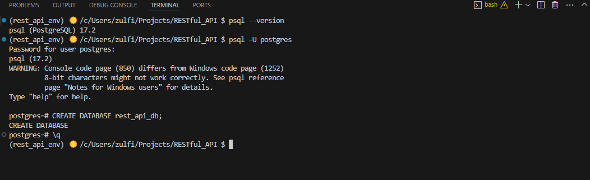
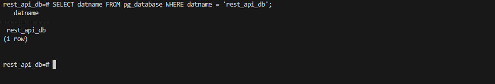
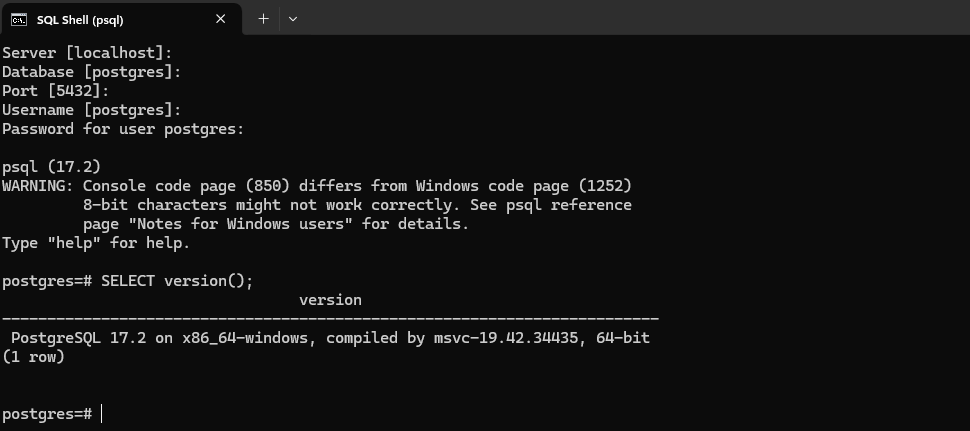

PostreSQL


1. Check connection to PostgreSQL using SQL Shell:
```
Server [localhost]: <default>
Database [postgres]: <default> 
Port [5432]: <default>
Username [postgres]: <default>
Password for user postgres: <password>
SELECT version();


2. Create a new database
CREATE DATABASE <database name>




checking if the database exists:


2. Create env file 
- create file and add connection string to the new database




ALTERNATIVE. Create database on render.com (free tier, availalbe for one month only)
- Create database restapi_database 
- copy connection string to .env file 
- add .env to .gitignore
- check connection with `python app.py`


