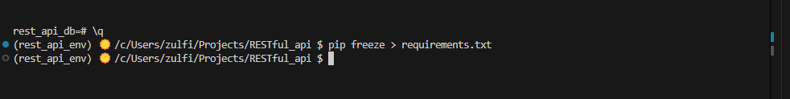

# RESTful-API
 
 Weblink: https://github.com/ZCHAnalytics/RESTful-API

## Project Overview: 
This project invovles the development of a RESTful API using Python's Flask framework and PostgreSQL. It demonstrates secure and efficient handling of database interactions through API endpoints.

## Objective: 
Build a REST API to:
- Interface with a PostgreSQL database.
- Handle SQL CRUD (Create, Read, Update, Delete) operations.
- ENsure secure handling of environment variables.


## Project tree:
```
RESTful_api
.
├── app.py
├── 0_create_dev_env.md
├── 1_create_database.md
├── 2_create_table.md
├── 3_search_data.md
├── images/
├── README.md
├── requirements.txt
├── .flaskenv
└── .gitignore
```

## Implementation Steps:

### 1. Set Up Development Environment:

 - Create a project directory `mkdir RESTful_API && cd RESTful_API`.
 - Create a GitHub repository. 
 - Set up a virtual Python environment `$ python -m venv rest_api_env`.
 - install necessary packages `$ pip install flask python-dotenv psycopg2-binary`.

### 2.	Create the Database in PostgreSQL

 - Define `.env` file to store the database connection string.
 - Add `.env` to `.gitignore` to prevent exposing senssitive information. 

### 3. Connect Flask App to the Database

- Use `psycorg2` to establish a connection between Flask and PostgreSQL.

### 4. Create and Populate Table

- Define tables in PostgreSQL using SQL `CREATE TABLE` statements.
- Populate tables via Flask endpoints. 

### 5. Handle Incoming Requests

- Implement Flask routes to handle HTTP methods (`GET`, `POST`).
- Create endpoints for adding data and retrieving data.

### 6. Retrieve Data from PostgreSQL

- Query the database and return JSON-formatted responses.

### 7. Search and Filter Data

- Add endpoints to allow search and filtering functionality. 

### 8. Calculate the average value in a data range 

- Add functionality to calculate averages over specified data ranges (WORK IN PROGRESS).

### 9. Freeze Package Requirements

- Generate `requirements.txt` file to capture all dependencies with `$ pip freeze > requirements.txt`.



### 10. Commit and Push Changes to GitHub
