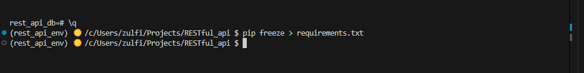

# RESTful-API

## Project Overview: 
RESTful API Development with Flask and PostgreSQL

## Objective: 
Develop a REST API using Python's Flask, interfacing with a PostgreSQL database

## Key Features:
- APIs endpoints for database interactions.
- SQL CRUD operations 
- Secure environment

## Project tree:

RESTful_api
.
├── app.py
├── 0_create_dev_env.md
├── 1_create_database.md
├── 2_create_table.md
├── 3_search_data.md
├── images
├── README.md
├── requirements.txt
└── .gitignore

## Implementation Steps:

### 1. Set Up Development Environment:

 - Create a project directory.
 - Create a GitHub repository. 
 - Set up a virtual Python environment.
    `$ python -m venv rest_api_env`
 - install  necessary Python packages (Flask, dotenv, psycorg2)
    `$ pip install flask python-dotenv psycopg2-binary` 

### 2.	Create the Database in PostgreSQL

 - Define `.env` file store the database  connection string.
 - Add `.env` to `.gitignore` to prevent exposing senssitive information. 

### 3. Connect Flask App to the Database

- Use `psycorg1` to establish a connection between Flask and PostgreSQL

### 4. Create and Populate Table

- Define tables in PostgreSQL using SQL `CREATE TABLE` statements.
- Populate tables via Flask endpoints. 

### 5. Handle incoming requests 

- Implement Flask routes to hnadle HTTP methods (`get`, `post`)
- Create endpoints for adding data and retrieving data

### 6. Retrieve data from PostgreSQL

- Query the database and return JSON-formatted responses.

### 7. Search and Filter Data

- Add endpoints to allow search and filtering. 

### 8. Calculate the average value in a data range - in progress

9. Freeze Package Requirements

- Use the following command to generate `requirements.txt`:
`$pip freeze > requirements.txt`

10. Commit and Push Changes to Git