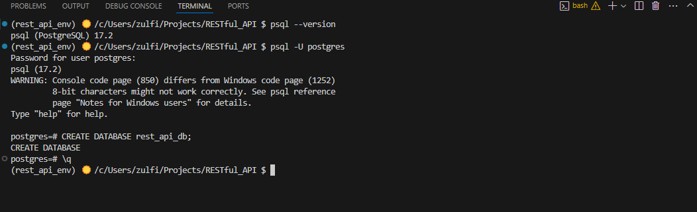
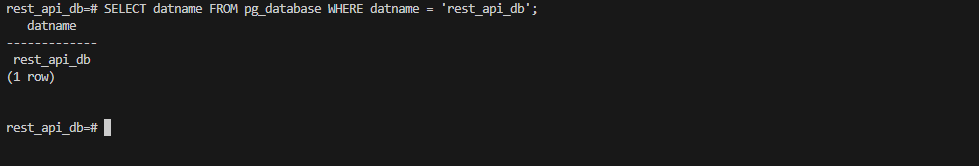
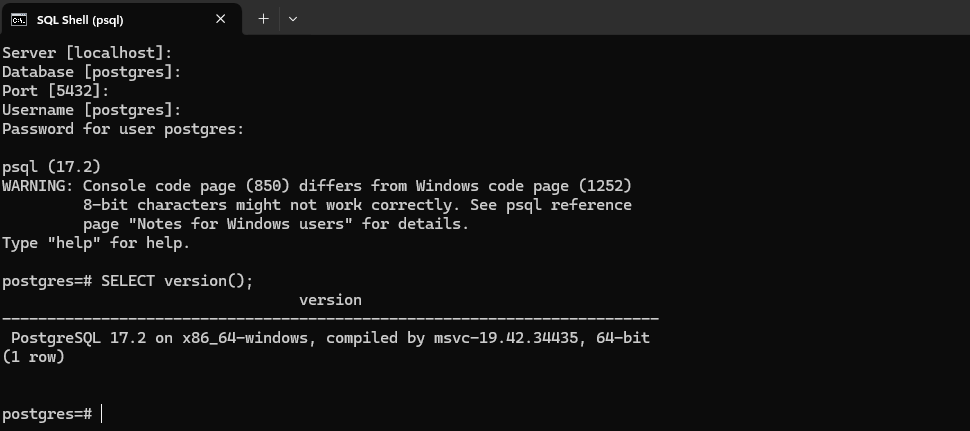

# Create PostreSQL Database

## 1. Check connection to PostgreSQL using SQL Shell:
 - Open the PostgreSQL SQL Shell (`psql`).
 - Enter connection values: 
```
Server [localhost]: <default>
Database [postgres]: <default> 
Port [5432]: <default>
Username [postgres]: <default>
Password for user postgres: <password>
```

- Verify the connection: 
`SELECT version();`

## 2. Create a New Database

`CREATE DATABASE rest_api_db;`




- Check if the database exists:



## 2. Edit `.env` file 

- Create or edit the `.env` file to add the connection string to the new database:




